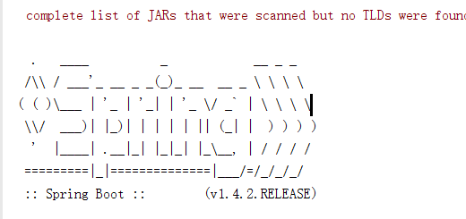
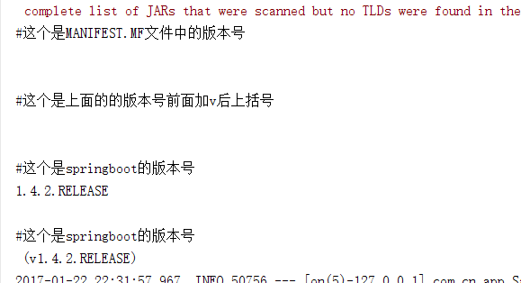

# springboot3

### 本节要点  
1. @ControllerAdvice注解的使用
2. 全局捕获异常
3. SpringBoot Application中指定扫描目录
4. @Configuration注解
5. WebBindingInitializer 的全局配置与局部配置
6. 拦截器  
7. 多文件上传
8. SpringBoot Banner的设置

#### @ControllerAdvice  
[官网文档](http://docs.spring.io/spring/docs/current/javadoc-api/org/springframework/web/bind/annotation/ControllerAdvice.html)  
是对Controller的增强,用来定义 @ExceptionHandler, @InitBinder, and @ModelAttribute
方法,是运行时注解，过多使用可能导致性能问题
#### 全局捕获异常
```java
package com.cn.app;

import com.cn.bean.City;
import org.springframework.web.bind.WebDataBinder;
import org.springframework.web.bind.annotation.ControllerAdvice;
import org.springframework.web.bind.annotation.ExceptionHandler;
import org.springframework.web.bind.annotation.InitBinder;
import org.springframework.web.bind.annotation.ModelAttribute;

/**
 * Created by Administrator on 1/21/2017.
 */
@ControllerAdvice
public class GlobalDefaultExceptionHandler {

    @ExceptionHandler(value = Exception.class)
    public void defaultErrorHandler(Exception e){
        e.printStackTrace();
        System.out.println("custom  glabol error handler");
    }

    @ModelAttribute
    public City getUserName(){
        System.out.println("============应用到所有@RequestMapping注解方法，在其执行之前把该方法的返回值放入Model" +
                "，jsp页面可以通过${city.cityName},${city.cityCode}获取其值");
        City city=new City();
        city.setName("北京");
        city.setCityCode("010");
        return city;
    }

    @InitBinder
    public void initBinder(WebDataBinder binder) {
        System.out.println("============应用到所有@RequestMapping注解方法，在其执行之前把http数据转换到对应的Java对象");
    }
}

```
#### SpringBoot Application中指定扫描目录
```java
package com.cn.app;

import org.springframework.boot.SpringApplication;
import org.springframework.boot.autoconfigure.SpringBootApplication;
import org.springframework.boot.builder.SpringApplicationBuilder;
import org.springframework.boot.web.support.SpringBootServletInitializer;

/**
 * Created by Administrator on 1/17/2017.
 */

@SpringBootApplication(scanBasePackages = "com.cn")
public class SampleApplication extends SpringBootServletInitializer {


    @Override
    protected SpringApplicationBuilder configure(SpringApplicationBuilder application) {
        return application.sources(SampleApplication.class);
    }


    public static void main(String[] args) {
        SpringApplication.run(SampleApplication.class, args);


    }

}


```
#### @Configuration注解
用于配置Bean,简化SpringMVC的xml配置方式,项目中可以有多个@Configuration类
#### WebBindingInitializer 的全局配置与局部配置  
上面的@ControllerAdvice里面的@InitBinder方法是每次调用Controller的
@RequestMapping修饰的方式掉用是因为运行时通过反射调用所以效率有些低
下面是全局的配置方式
```java
package com.cn.configuare;

import com.alibaba.fastjson.serializer.SerializerFeature;
import com.alibaba.fastjson.support.config.FastJsonConfig;
import com.alibaba.fastjson.support.spring.FastJsonHttpMessageConverter;
import org.springframework.boot.autoconfigure.web.HttpMessageConverters;
import org.springframework.context.annotation.Bean;
import org.springframework.context.annotation.Configuration;
import org.springframework.http.converter.HttpMessageConverter;
import org.springframework.web.bind.support.ConfigurableWebBindingInitializer;
import org.springframework.web.bind.support.WebBindingInitializer;

/**
 * Created by Administrator on 1/21/2017.
 */
@Configuration
public class CustomConfiguration {


    /**
     * HttpMessageConverters
     * springboot 官方文档：http://docs.spring.io/spring-boot/docs/2.0.0.BUILD-SNAPSHOT/reference/htmlsingle/
     * Spring MVC uses the HttpMessageConverter interface to convert HTTP requests and responses.
     * Sensible defaults are included out of the box, for example Objects can be automatically converted to
     * JSON (using the Jackson library) or XML (using the Jackson XML extension if available, else using JAXB).
     * Strings are encoded using UTF-8 by default.
     *If you need to add or customize converters you can use Spring Boot’s HttpMessageConverters class:
     * SpringMVC使用HttpMessageConverter接口将HTTP requests and responses转换成JSON数据
     * 如果你想自定义这个转换器你可以使用SpringBoot的 HttpMessageConverters类
     * @return
     */
    @Bean
    public HttpMessageConverters customConverters() {
        FastJsonHttpMessageConverter fastConverter = new FastJsonHttpMessageConverter();
        FastJsonConfig fastJsonConfig = new FastJsonConfig();
        fastJsonConfig.setSerializerFeatures(SerializerFeature.PrettyFormat);
        fastConverter.setFastJsonConfig(fastJsonConfig);
        HttpMessageConverter<?> converter = fastConverter;
        return new HttpMessageConverters(converter);
    }

    /**
     * Spring MVC uses a WebBindingInitializer to initialize a WebDataBinder for a particular request.
     * If you create your own ConfigurableWebBindingInitializer @Bean,
     *  Spring Boot will automatically configure Spring MVC to use it.
     *
     * @return
     */
    @Bean
    WebBindingInitializer getCustomDataBinder() {
        ConfigurableWebBindingInitializer dataBinder = new ConfigurableWebBindingInitializer();
        return dataBinder;
    }


}

```

#### 拦截器  
不能修改reques的内容但是可以通过抛出异常或者return false来停止本次请求
编写一个自定义拦截器继承HandlerInterceptor
```java
package com.cn.configuare;

import org.springframework.web.servlet.HandlerInterceptor;
import org.springframework.web.servlet.ModelAndView;

import javax.servlet.http.HttpServletRequest;
import javax.servlet.http.HttpServletResponse;

/**
 * Created by Administrator on 1/22/2017.
 */

public class LoginInterceptor implements HandlerInterceptor {


    @Override
    public boolean preHandle(HttpServletRequest request, HttpServletResponse response, Object handler) throws Exception {
        System.out.println("登录拦截器");
        //这里必须返回true返回false表示拦截次请求
        return true;
    }

    @Override
    public void postHandle(HttpServletRequest request, HttpServletResponse response, Object handler, ModelAndView modelAndView) throws Exception {

    }

    @Override
    public void afterCompletion(HttpServletRequest request, HttpServletResponse response, Object handler, Exception ex) throws Exception {

    }
}

```
```java
package com.cn.configuare;

import org.springframework.context.annotation.Configuration;
import org.springframework.web.servlet.config.annotation.InterceptorRegistry;
import org.springframework.web.servlet.config.annotation.WebMvcConfigurerAdapter;

/**
 * Created by Administrator on 1/22/2017.
 */
@Configuration
public class CustomWebConfiguare extends WebMvcConfigurerAdapter {

    @Override
    public void addInterceptors(InterceptorRegistry registry) {
        LoginInterceptor loginInterceptor = new LoginInterceptor();
        registry.addInterceptor(loginInterceptor);
        super.addInterceptors(registry);
    }
}

```

#### 文件上传  
Controller代码
```java
package com.cn.controller;

import org.springframework.stereotype.Controller;
import org.springframework.web.bind.annotation.GetMapping;
import org.springframework.web.bind.annotation.PostMapping;
import org.springframework.web.bind.annotation.RequestParam;
import org.springframework.web.bind.annotation.ResponseBody;
import org.springframework.web.multipart.MultipartFile;

import java.io.BufferedOutputStream;
import java.io.File;
import java.io.FileOutputStream;
import java.io.OutputStream;
import java.util.LinkedList;

/**
 * Created by Administrator on 1/22/2017.
 */
@Controller
public class FileUploadController {
    
    @GetMapping("/register")
    public String register() {
        return "register";
    }

    @PostMapping("/handleRegister")
    @ResponseBody
    public String handleRegister(@RequestParam String username, @RequestParam String password, @RequestParam LinkedList<MultipartFile> materyal) {
        System.out.println(username);
        System.out.println(password);

        for (int i = 0; i < materyal.size(); i++) {
            MultipartFile file = materyal.get(i);
            OutputStream stream = null;
            if (!file.isEmpty()) {
                String uploadUrl = "D:\\springprojects\\uploadedfiles\\" + file.getOriginalFilename();
                try {
                    byte[] bytes = file.getBytes();
                    stream =new BufferedOutputStream(new FileOutputStream(new File(uploadUrl)));
                    stream.write(bytes);
                    stream.close();
                } catch (Exception e) {
                    stream = null;
                    return "You failed to upload  => " + e.getMessage();
                }
            } else {
                return "You failed to upload  because the file was empty.";
            }
        }

        return "success";
    }
}

```

register.jsp
```jsp
<%--
  Created by IntelliJ IDEA.
  User: Administrator
  Date: 1/22/2017
  Time: 5:19 PM
  To change this template use File | Settings | File Templates.
--%>
<%@ page contentType="text/html;charset=UTF-8" language="java" %>
<html>
<head>
    <title>Title</title>
</head>
<body>
<form method="post" enctype="multipart/form-data" action="/handleRegister">


    <div><label>用户名：</label><input name="username"></div>

    <div><label>密码：</label><input name="password"></div>

    <div> <label>工程文件1：</label><input type="file" name="materyal"></div>
    <div> <label>工程文件2：</label><input type="file" name="materyal"></div>
    <div> <label>工程文件3：</label><input type="file" name="materyal"></div>

    <div> <input type="submit" value="提交"></div>
</form>
</body>
</html>
```
在Configuare中配置Bean设置上传文件大小
```java
package com.cn.configuare;

import com.alibaba.fastjson.serializer.SerializerFeature;
import com.alibaba.fastjson.support.config.FastJsonConfig;
import com.alibaba.fastjson.support.spring.FastJsonHttpMessageConverter;
import org.springframework.boot.autoconfigure.web.HttpMessageConverters;
import org.springframework.boot.web.servlet.MultipartConfigFactory;
import org.springframework.context.annotation.Bean;
import org.springframework.context.annotation.Configuration;
import org.springframework.http.converter.HttpMessageConverter;
import org.springframework.web.bind.support.ConfigurableWebBindingInitializer;
import org.springframework.web.bind.support.WebBindingInitializer;
import org.springframework.web.servlet.HandlerInterceptor;

import javax.servlet.MultipartConfigElement;

/**
 * Created by Administrator on 1/21/2017.
 */
@Configuration
public class CustomConfiguration {


    /**
     * HttpMessageConverters
     * springboot 官方文档：http://docs.spring.io/spring-boot/docs/2.0.0.BUILD-SNAPSHOT/reference/htmlsingle/
     * Spring MVC uses the HttpMessageConverter interface to convert HTTP requests and responses.
     * Sensible defaults are included out of the box, for example Objects can be automatically converted to
     * JSON (using the Jackson library) or XML (using the Jackson XML extension if available, else using JAXB).
     * Strings are encoded using UTF-8 by default.
     *If you need to add or customize converters you can use Spring Boot’s HttpMessageConverters class:
     * SpringMVC使用HttpMessageConverter接口将HTTP requests and responses转换成JSON数据
     * 如果你想自定义这个转换器你可以使用SpringBoot的 HttpMessageConverters类
     * @return
     */
    @Bean
    public HttpMessageConverters customConverters() {
        FastJsonHttpMessageConverter fastConverter = new FastJsonHttpMessageConverter();
        FastJsonConfig fastJsonConfig = new FastJsonConfig();
        fastJsonConfig.setSerializerFeatures(SerializerFeature.PrettyFormat);
        fastConverter.setFastJsonConfig(fastJsonConfig);
        HttpMessageConverter<?> converter = fastConverter;
        return new HttpMessageConverters(converter);
    }

    /**
     * Spring MVC uses a WebBindingInitializer to initialize a WebDataBinder for a particular request.
     * If you create your own ConfigurableWebBindingInitializer @Bean,
     *  Spring Boot will automatically configure Spring MVC to use it.
     *
     * @return
     */
    @Bean
    WebBindingInitializer getCustomDataBinder() {
        ConfigurableWebBindingInitializer dataBinder = new ConfigurableWebBindingInitializer();
        return dataBinder;
    }

    @Bean
    public MultipartConfigElement multipartConfigElement() {
        MultipartConfigFactory factory = new MultipartConfigFactory();
        //// 设置文件大小限制 ,超了，页面会抛出异常信息，这时候就需要进行异常信息的处理了;
        factory.setMaxFileSize("100MB"); //KB,MB
        /// 设置总上传数据总大小
        factory.setMaxRequestSize("100MB");
        //Sets the directory location where files will be stored.
        //factory.setLocation("路径地址");
        return factory.createMultipartConfig();
    }

}

```
#### SpringBoot Banner设置
1.  什么是Banner  

2.  修改启动类
```java
package com.cn.app;

import org.springframework.boot.SpringApplication;
import org.springframework.boot.autoconfigure.SpringBootApplication;
import org.springframework.boot.builder.SpringApplicationBuilder;
import org.springframework.boot.web.support.SpringBootServletInitializer;

/**
 * Created by Administrator on 1/17/2017.
 */

@SpringBootApplication(scanBasePackages = "com.cn")
public class SampleApplication extends SpringBootServletInitializer {


    @Override
    protected SpringApplicationBuilder configure(SpringApplicationBuilder application) {
        return application.sources(SampleApplication.class);
    }


    public static void main(String[] args) {
        //修改启动方式
        SpringApplication application=new SpringApplication(SampleApplication.class);
        //关闭Banner
        //application.setBannerMode(Banner.Mode.OFF);
        application.run(args);
        //SpringApplication.run(SampleApplication.class, args);


    }

}


```
3.  在src/main/resouces下新建banner.txt，在文件中加入：
```properties
#这个是MANIFEST.MF文件中的版本号 
${application.version}              
 
#这个是上面的的版本号前面加v后上括号 
${application.formatted-version}
 
#这个是springboot的版本号 
${spring-boot.version}             
 
#这个是springboot的版本号 
${spring-boot.formatted-version}
```
运行效果  

4. 在application.properties文件中添加
```properties
#是否显示Banner
spring.main.show-banner=false
```
5. 通过SpringApplication的setBanner方法自行绘制Banner样式
```java
package com.cn.app;

import org.springframework.boot.Banner;
import org.springframework.boot.SpringApplication;
import org.springframework.boot.autoconfigure.SpringBootApplication;
import org.springframework.boot.builder.SpringApplicationBuilder;
import org.springframework.boot.web.support.SpringBootServletInitializer;
import org.springframework.core.env.Environment;

import java.io.PrintStream;

/**
 * Created by Administrator on 1/17/2017.
 */

@SpringBootApplication(scanBasePackages = "com.cn")
public class SampleApplication extends SpringBootServletInitializer {


    @Override
    protected SpringApplicationBuilder configure(SpringApplicationBuilder application) {
        return application.sources(SampleApplication.class);
    }


    public static void main(String[] args) {
        //修改启动方式
        SpringApplication application=new SpringApplication(SampleApplication.class);

        //自己编写Banner的输出样式
//        application.setBanner(new Banner() {
//            @Override
//            public void printBanner(Environment environment, Class<?> sourceClass, PrintStream out) {
//
//            }
//        });
        //关闭Banner
        //application.setBannerMode(Banner.Mode.OFF);
        application.run(args);
        //SpringApplication.run(SampleApplication.class, args);


    }

}


```


